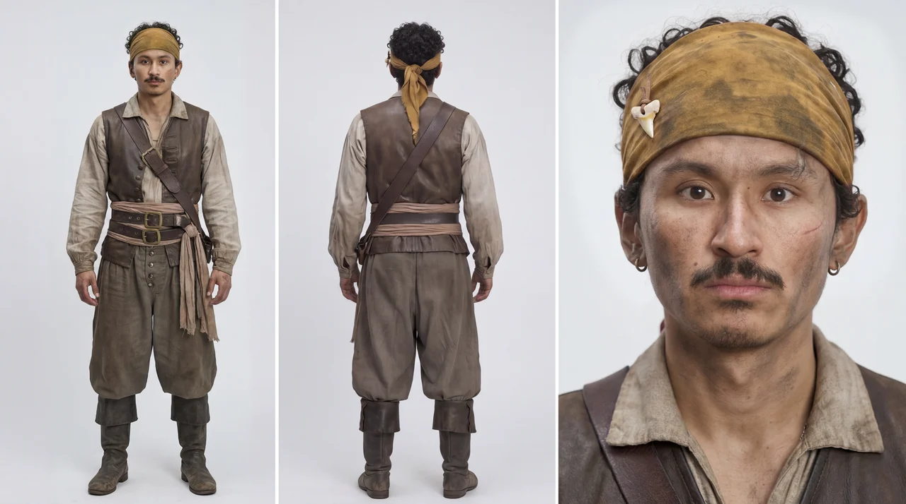
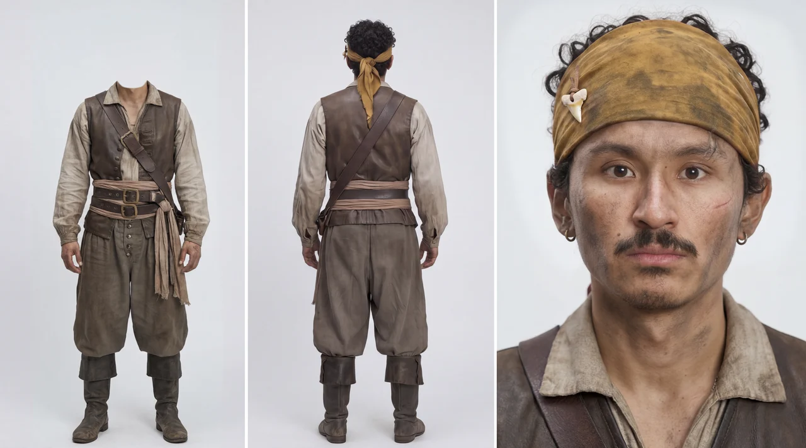

# Seedream Character Sheet Cleanup

Inspect a Seedance-bound character sheet against the requested reference policy,
then write a paste-ready Seedream **image-edit** prompt that fixes it. The user
pastes the block into Lumina or another Seedream edit UI together with the
source sheet. This skill never edits, uploads, or submits anything.

Use this cleanup only when an extra readable face violates that policy or the
user explicitly requests the edit.

The purpose is simple: a character sheet with multiple readable faces can
confuse Seedance during downstream video generation. If the front full-body
panel shows a second readable face, the model can drift between faces over time.
The cleanup keeps only one face anchor: the dedicated close-up panel.

This skill is designed to partner with:
- `seedream-character-sheet` for the original three-panel sheet
- `seedream-prompt` for the Seedream edit grammar (`@Image N`, `<bbox>`, edit
  modes) in its image-editing reference

## Non-destructive output rule

Never overwrite the source character sheet. Tell the user to save the edit
result as a **new image file or new version** so the original stays available
for review, rollback, or alternate use.

## When to Invoke

Invoke this skill when all of the following are true:
- a character sheet already exists
- the sheet contains a dedicated close-up face panel
- at least one full-body panel still shows a readable face
- the sheet will later be used as a Seedance identity lock or character reference
- the intended reference policy calls for one readable face

Do not invoke this skill when:
- the sheet already has only one readable face
- the user explicitly wants visible facial detail in multiple panels
- the image is a regular portrait sheet rather than a Seedance-facing identity sheet
- the sheet has no usable close-up panel: regenerate it from a revised
  `seedream-character-sheet` prompt instead

## Core Rule

For Seedance-facing character sheets, keep exactly one readable face on the
sheet: the close-up panel.

The front full-body panel should preserve:
- pose
- clothing
- silhouette below the shoulders
- panel spacing
- background consistency

The front full-body panel should NOT preserve the head at all. Remove the
entire head (and optionally the neck) so the figure is headless. Do not blur
the face and do not replace it with a featureless surface: the head must be
gone, with the studio background filling the space where it was.

## Default Cleanup Target

The default target is the front full-body panel's head.

If the back-view panel accidentally exposes too much face because of head turn
or profile leakage, clean that panel too. The close-up face panel remains the
only authoritative face and stays untouched.

## Identity preservation

Cleanup can alter silhouette, hair, headwear, costume, or the close-up identity
anchor. Before handoff, ask the user to compare the original and edited image
against the approved visible descriptors, and list the features that must
remain unchanged. Do not infer a person's gender identity from their
appearance.

Use one trigger: the intended downstream reference policy requires a single
readable face and inspection finds an extra readable face in a body panel, or
the user explicitly requests this cleanup. A failed video is not required.
If the sheet already meets the requested policy, keep it unchanged. Any cleanup
is a new unapproved version; preserve the original and ask the user to select
before switching the canonical reference.

## Edit mode

This is a **deletion** edit, not a full regeneration. Use the Seedream
image-editing structure from `seedream-prompt` and position the edit with one
of its two forms:

- **Precise coordinates** (Seedream 5.0 Pro): a `<bbox>x1 y1 x2 y2</bbox>` tag
  around the entire head in the full-body panel. The coordinates come from the
  user's annotation tool; this skill only supplies a starting estimate.
- **Free-form marker**: the user draws a colored frame around the head on the
  source sheet and the prompt names that frame. Use this when the destination
  UI has no coordinate input.

Box the whole head (hair and headwear included), not just the facial features.
Do not box the entire panel unless absolutely necessary.

## Prompt Template

Default edit block (head removed, neck kept):

```text
References:
@Image 1: character sheet to edit

Task:
Image Editing

Editing mode:
Deletion, positioned with <bbox>454 22 549 204</bbox>

Edit instructions:
In @Image 1, remove the entire head from the full-body front-view panel so the
figure is headless. There must be no head, no face, no hair and no headwear in
that panel. Fill the space where the head was with the studio background.

Constraints:
Keep the neck, shoulders, body, costume, pose, panel spacing, divider lines,
studio background, and the close-up face panel unchanged.
```

Stronger variant: use it when the user also wants the neck removed, or when the
edit keeps recreating a head.

```text
References:
@Image 1: character sheet to edit

Task:
Image Editing

Editing mode:
Deletion, positioned with <bbox>454 22 549 204</bbox>

Edit instructions:
In @Image 1, remove the entire head and neck from the full-body front-view
panel so the body begins at the shoulders and collarbone. Fill the space where
the head and neck were with the studio background.

Constraints:
Keep the shoulders, body, costume, pose, panel spacing, divider lines, studio
background, and the close-up face panel unchanged.
```

Free-form marker variant: replace the `Editing mode` line with
`Deletion, positioned with the red frame drawn on @Image 1`, and start the edit
instruction with `In the red frame on @Image 1, remove ...`.

## Coordinate Guidance

- Place the box around the entire head in the full-body panel (hair and
  headwear included, down to the neck), not just the facial features.
- Include the neck inside the box when the user wants the neck removed too.
- Avoid covering the shoulders, torso, divider line, or close-up panel.
- A box that is too small leaves a blurred or featureless head. Widen it to the
  full head before changing the prompt wording.

For the standard three-panel 16:9 sheet (for example 2048×1152), the front
full-body panel is the middle third and the head sits at the top of that panel.
The `<bbox>454 22 549 204</bbox>` in the templates is a starting estimate on a
0–999 normalized scale. It covers the head and neck with margin and stays clear
of the panel divider lines. Treat it as a placeholder: tell the user to replace
it with coordinates from their annotation tool and widen it if a face remains
in the center panel. Substitute the real values before handoff.

## Acceptance Check

This workspace cannot inspect the result, so give the user this checklist to
run when they compare the original and edited sheets side by side at readable
resolution. The cleanup succeeded when:
- the close-up panel is the only readable face on the sheet
- the front full-body panel shows no head at all: the figure is headless and
  the studio background fills the space where the head was
- the front full-body panel still reads as the same character and costume
- the sheet layout remains stable
- the background and divider lines stay consistent
- no blurred face, featureless head, or new facial detail appears in the body
  panels

If a readable face remains in a targeted body panel, or the close-up is
damaged, revise the box or the instruction and write a new edit block. Repeat
the check after every re-edit so a second-face sheet never reaches Seedance. Do
not hand the sheet to Seedance until the user confirms the check passes and
selects that version.

## Workflow

1. Assume a three-panel sheet exists (for example from `seedream-character-sheet`).
2. Ask the user to inspect the full-body panels for duplicate readable faces.
3. If an extra face violates the requested single-face policy, write the edit block.
4. The user pastes it with the source sheet into the Seedream edit UI and runs it.
5. The user runs the acceptance check against the approved visible descriptors.
6. The user saves the cleaned sheet as a **new version/file**, not an overwrite.
7. The user selects the new version before canonical use.

## Examples

The pair below shows a before-and-after for inspection context. It is not an
instruction to edit every sheet: the requested reference policy decides.

- Before: the left full-body panel still shows a readable front face, while the
  right close-up panel also shows the face. This creates two competing face
  anchors.
- After: the left full-body panel keeps the body, costume, and headwear, but the
  readable face is removed, so the right close-up panel is the only face anchor
  left on the sheet.

### Before



### After



Treat the pair as illustrative evidence, not user approval of a new output or a
substitute for the requested visible descriptors.
